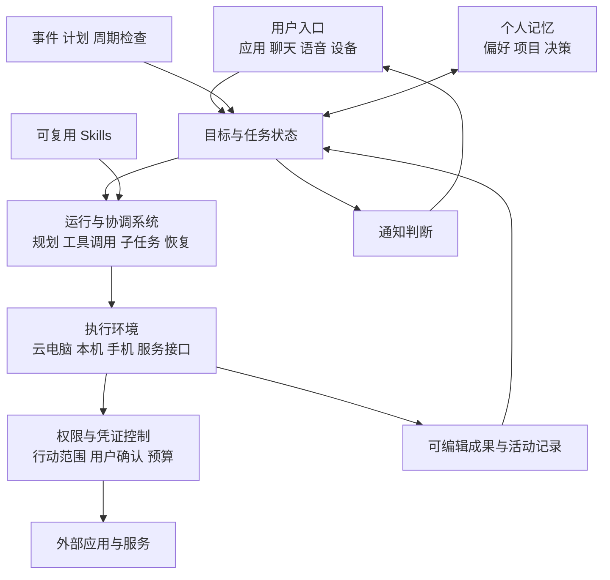

研究截止时间为 **2026年10月3日**。本报告从 Meta Muse 出发，覆盖 20 家公司或产品团队的个人代理、工作代理与相邻助手，以及 OpenClaw、Hermes 两个有代表性的开源运行平台。这20家并非全部提供同类 Personal Agent。重点研究个人代理的发展，同时用工作代理比较产品定位、技术形态和价值验证。

**核心判断：2026 年个人代理与工作代理都在把持续负责的任务、自己的执行环境和可控的行动权限组合成完整产品。** Muse 对长期个人代理体验做了较完整的整合；Cowork、Computer、Scout 则提供工作执行与企业代理的对照。它们不能仅凭自主执行能力被视为同一产品类别。公开资料不足以确认 Muse 的市场份额、留存或实际任务成功率领先。Cue 把“代理自己的身份”推得更明确，适合与 Muse 对照研究。[Meta 发布说明][S01]、[Google Spark 发布说明][S15]、[Microsoft Scout 发布说明][S18]、[Cue 发布说明][S24]

这是一份基于公开一手资料的产品与架构研究。官方公布的能力代表产品承诺或文档定义，本报告没有进行账号全量实测、交易实测或安全审计。文中的“判断”“推论”“建议”是分析观点；“计划”“预览”“早期访问”保留原有交付边界。中国部分按团队与市场相关性覆盖，Cue 单列为重点，未将国际版能力默认视为中国大陆可用。

## 主要发现

1. **持续责任是个人代理与工作代理的共同发展方向。** Muse 的 Goals、dot 的持续工作、Spark 的后台任务，都让用户能够交代一个需要多次行动的目标；企业 Autopilot 也能持续承担工作角色。聊天只是其中一个入口，系统还需要保存状态、等待事件、继续推进和汇报进展。[Muse 产品设计][S02]、[dots 文档][S05]、[Spark 发布说明][S15]、[Autopilot][S19]
2. **有个人上下文和能自主执行是两个维度。** Gemini Personal Intelligence 与 Siri AI 强调理解个人信息和当前设备情境；Muse、dots、Spark、Grok Bot 则进一步明确云端持续执行。产品比较需要分别看上下文、执行环境、持续性与权限，不能只看“personal”这个词。[Google 个人上下文说明][S14]、[Siri AI 发布说明][S20]
3. **代理正在取得自己的身份。** Cue 明确为每个代理提供邮箱、电话、钱包和电脑；Grok Bot 支持多个持续运行的 bot 协作；Microsoft Autopilot 在企业租户中拥有自己的身份。它们改变了代理与人、服务及其他代理的交互方式。[Cue 发布说明][S24]、[Grok Bot 发布说明][S21]、[Autopilot 发布说明][S19]
4. **技术竞争的范围扩大到完整运行系统。** 模型负责判断和生成，运行系统负责持久状态、工具、恢复、调度与权限。Meta 把执行环境和 Sentinel 权限控制分离；Anthropic 把 session、harness、sandbox 分离。这些设计支持更长时间、更少人在场的工作。[Muse 安全架构][S03]、[Anthropic Managed Agents 架构][S12]
5. **中国市场至少出现四条路线。** 阿里侧重交易服务整合；腾讯、百度、有道侧重桌面工作与消息入口；字节、小米侧重手机及系统执行；Kimi、MiniMax、ArkClaw 等提供托管 OpenClaw。它们的优势来源和运行条件差异很大，适合按场景比较。[千问发布说明][S27]、[QClaw 文档][S29]、[Kimi Claw 文档][S35]、[小米一手披露][S40]
6. **工作代理的使用数据不能直接证明个人代理的采用。** Anthropic 公布的一个 Cowork 样本中，业务流程类会话占 33.4%，个人助理类占 3.8%。它提供办公任务的使用证据；其中“个人助理”是会话任务分类，不等于本报告的 Personal Agent 产品分类，不能据此推算个人代理需求或成熟度。[Cowork 使用研究][S11]
7. **WorkBuddy 主要应归为 Work Agent。** 它的职场定位、文件与办公成果交付构成主要依据。个人安装和使用、具备记忆或自动化，都不足以把它归为以长期个人关系为中心的 Personal Agent。[官方产品定位][S30]

## 研究口径与比较方法

本报告将 **Work Agent** 理解为以工作任务、项目或职业角色为主要责任域的代理；将 **Personal Agent** 理解为以某个人的长期目标、偏好与持续委托关系为主要组织方式的代理，任务可以横跨工作与生活。前者主要描述工作场景，后者主要描述服务关系，两者可以重叠。本报告不再把所有由个人使用的工作工具纳入同类 Personal Agent。

为避免厂商对“personal”的不同用法混在一起，分类时分别记录三个轴：**责任域**是工作、生活还是跨域；**服务关系**以任务或工作角色为中心，还是以个人长期关系为中心；**治理主体**是个人、组织还是两者共同约束。这是研究框架，不是行业统一术语标准。执行位置和持续运行能力另外记录，不作为 work 与 personal 的单独分界。

比较使用下列维度。它们是分析框架，没有把产品强行放进一条统一的成熟度等级，也没有用未经验证的数字打分。

| 维度 | 要核实的问题 | 容易误读之处 |
| --- | --- | --- |
| 个人上下文 | 能使用哪些个人数据，记忆能否查看、编辑和删除 | 接入邮箱不等于理解用户全部生活 |
| 持续责任 | 任务能否跨会话保存，何时主动继续，如何认定完成 | 一次定时摘要不等于持续追踪目标 |
| 执行环境 | 在云端、本机、手机系统或服务 API 中行动 | 本地执行不等于模型推理及数据传输都在本地 |
| 行动权限 | 谁能授权，读写是否分开，能否限制范围和撤销 | “只用这个文件夹”的聊天指令未必是硬隔离 |
| 代理身份 | 是否有独立地址、号码、账户、预算或团队角色 | 能给自己起名字不等于有独立外部身份 |
| 恢复与监督 | 是否有活动记录，失败后能否继续，如何停止全部工作 | 停止主对话未必停止子任务和未来调度 |
| 开放状态 | 已上线、滚动开放、私测、候补名单还是计划 | 发布会展示不能当作所有用户已经可用 |

WorkBuddy、Dumate、Cowork 等纳入工作代理对照；Siri AI、小艺领域智能体等纳入相邻助手对照。它们没有被全部视为与 Muse、Cue 完全同类。企业 agent builder、客服机器人、仅用于编程的代理和基础模型不是本报告的主产品集合。

## Work Agent 与 Personal Agent 的异同

### 两种产品取向的共同能力

两者都可以使用工具、浏览器、文件、程序、记忆、skills 和子代理，也都可能处理多步骤任务、持续运行和主动跟进。WorkBuddy 官方明确支持自主规划与办公执行；Autopilot 又证明工作代理可以有自己的身份、记忆、电脑，并跨多天推进目标。因而，是否7×24、是否有独立电脑、是否会主动发消息，都不能单独决定产品属于哪一类。[WorkBuddy 定位][S30]、[Autopilot 定位][S19]

下面比较的是两种产品取向的典型设计重点，属于分析判断，不表示每款产品都满足表中全部特征。

| 比较维度 | 以工作为中心的代理 | 以长期个人关系为中心的代理 |
| --- | --- | --- |
| 主要责任 | 推进工作任务、项目或职业角色的目标 | 持续协调某个人的目标、偏好和事务，可跨工作与生活 |
| 任务组织 | 项目、流程、角色、交付物与截止日期 | 个人目标、事项、生活情境与跨任务优先级 |
| 上下文重点 | 项目资料、业务数据、文档版本、团队决策 | 稳定偏好、历史选择、个人约束与不同事务的关联 |
| 权限来源 | 用户授权；组织场景还受组织身份、资源和政策约束 | 个人账户、设备和预算授权；接工作资源时同样受组织约束 |
| 记忆设计 | 更需按项目和角色分隔，考虑共享及工作交接 | 更需支持长期连续性、纠错、删除和跨场景使用边界 |
| 成功标准 | 成果被验收，流程推进，准确、及时且可复现 | 个人目标有进展，少重复解释和管理，通知值得打扰 |
| 商业价值验证 | 节省的工作时间、成果质量、流程吞吐及成本 | 有用责任的持续委托、长期使用、信任与总管理负担 |

这些差异改变产品优先级，但不产生两套完全独立的技术栈。例如同样是处理邮箱，工作代理可能把邮件转成销售流程或项目跟进；个人代理可能同时协调行程、家庭事项和工作截止日。真正需要核实的是它为谁承担什么责任、使用什么上下文，以及行动受谁约束。

### WorkBuddy 为什么主要属于 Work Agent

WorkBuddy 的官方定位围绕职场桌面工作台展开，核心场景包括本地文件处理、文档与表格生成、数据分析、行业调研及多代理办公协作。按本报告框架，其主要责任域是工作，主要验收对象是工作成果，因此归为 **Work Agent**。[官方产品说明][S30]

个人订阅或安装说明使用方式，并不改变这个主定位。即使加入记忆、消息入口和周期自动化，仍然可以是一款持续工作代理。若要进一步认定它具有明确的长期 Personal Agent 产品定位，还需要看到跨任务个人目标统筹、长期偏好维护及相应产品组织方式。当前证据不支持仅凭自主执行把这两类等同。

Work Agent 也不等于 Enterprise Agent。个人可以使用工作代理，企业版本则可能进一步提供团队身份、管理员控制与治理能力；不能把“面向工作”自动推成“每个版本都有企业治理”。

### 当前产品的分类调整

以下归类是基于当前定位和公开能力的研究判断，可重叠，不是厂商共同采用的官方分类，也不评价产品成熟度。通用执行与托管平台保留中间类别，避免硬归为生活或工作产品。

| 产品 | 主要归类或观察角度 | 归类理由与边界 |
| --- | --- | --- |
| WorkBuddy | Work Agent | 职场工作台与办公成果交付是主要定位。[WorkBuddy 文档][S30] |
| Claude 原 Cowork、ChatGPT Work | 工作执行能力与 Work Agent 对照 | 重点承接工作和交付成果；整个 Claude 或 ChatGPT 品牌的使用范围更广。[Claude 更新][S10]、[Work 发布][S08] |
| Microsoft Autopilot | 具有个人化服务关系的 Work Agent | 长期服务具体用户，但工作身份、资源与治理位于企业租户。官方也使用 personal 一词。[Autopilot 发布][S19] |
| Dumate、LobsterAI | Work Agent 对照 | 桌面办公与文件任务定位明显；后者具备记忆与多消息渠道也不自动改变责任域。[Dumate 文档][S34]、[有道官网][S39] |
| Muse、Cue | 以长期个人关系为中心的 Personal Agent | 个人目标或有身份的个人代理团队是核心组织方式，亦可执行工作任务。[Muse 设计][S02]、[Manus 与 Cue 发布][S24] |
| dots、Gemini Spark | 长期个人代理与工作委托的交叉形态 | 持续服务用户并承担工作；企业或消费版本的治理应分别核实。[dots 文档][S05]、[Spark 发布][S15] |
| Grok Bot、Genspark Claw | 持续通用代理，工作团队或员工定位明显 | 有长期记忆与持续执行，可见团队不直接等于生活个人代理。[Grok Bot 发布][S21]、[Genspark 文档][S26] |
| Manus 2.0、Perplexity Computer | 通用任务与项目执行平台 | 可完成多种任务；需另看长期个人关系如何组织，不能仅据云电脑归类。[Manus 与 Cue 发布][S24]、[Perplexity 更新][S22] |
| QClaw、AutoClaw、DuClaw | 通用个人电脑或消息执行代理 | 工作用途明显；本轮证据不足以统一判定其长期跨域个人关系能力。[QClaw 文档][S29]、[AutoClaw 官网][S37]、[DuClaw 文档][S33] |
| Kimi Claw、MaxClaw、ArkClaw | 托管通用代理平台 | 降低部署门槛，能承接工作或个人事务；具体服务关系与治理仍按版本判断。[Kimi 文档][S35]、[MaxClaw 官网][S36]、[ArkClaw 文档][S32] |
| 千问 | 生活交易服务为重点，兼有工作执行 | 生态交易能力明确，Task Assistant 又涉及研究等工作任务。[千问发布][S27]、[淘宝整合][S28] |
| Siri AI、豆包手机助手、miclaw | 系统个人助手或设备执行路线 | 系统上下文与应用操作是主要观察角度，长期跨域代理能力与开放状态另核。[Siri AI 发布][S20]、[豆包官网][S31]、[小米披露][S40] |
| 小艺领域智能体、Personal Intelligence | 相邻助手或个人上下文能力 | 领域助手与个人信息连接不单独证明持续自主代理形态。[小艺介绍][S41]、[个人上下文说明][S14] |

### 对产品路线与研究结论的影响

**判断：** 工作代理较容易从文件、流程与可验收成果建立明确价值；长期个人代理还需要证明持续理解与跨事务协调能减少用户管理负担。因此，WorkBuddy 的有效办公案例不能直接证明 Muse 或 Cue 的长期个人关系有价值，反过来个人代理的生活演示也不能替代工作成果验收。

**推论：** 两类产品可以形成分工：长期个人代理维护用户目标和跨任务优先级，将具体工作交给工作执行代理，再跟进结果。dots 可委派 Work 或 Codex 任务，是这种分工的一项产品证据；本报告没有假定 Muse、Cue 已经原生接入 WorkBuddy。[dots 文档][S05]

**评估建议：** 对工作代理更重视成果被验收、准确性、截止日、工作流推进及人工审核时间；对长期个人代理增加跨事务目标进展、偏好纠正、重复解释、有效通知与用户协调负担。两者都测试权限、恢复和总成本。长期运行属于共同能力，不能作为 Personal Agent 独有优势。

## 2026年产品演进时间线

以下日期以官方正文为准，区别发布日、更新日、数据窗口与后续计划。

| 时间 | 已核实事件 | 发展意义或交付边界 |
| --- | --- | --- |
| 1月12日 | Cowork 以研究预览推出；1月13日 Anthropic 文章称其前一天发布 | 桌面文件与执行能力开始成为独立办公体验。[官方文章][S09] |
| 1月14日 | Gemini Personal Intelligence 发布 | 把个人 Gmail、Photos、YouTube、Search 上下文连接起来；这是个性化的重要进展。[官方文章][S14] |
| 1月15日 | 千问宣布扩展为能办事的入口，连接交易与生活服务 | 中国出现明确的生态交易路线；Task Assistant 在当时仍为邀请测试。[官方文章][S27] |
| 3月 | Perplexity Computer 与 Personal Computer 路线推进；小米披露 miclaw 小范围封测 | 前者探索云与本机执行，后者探索手机和设备生态执行。Personal Computer 的3月状态为候补名单。[Perplexity 更新][S22]、[小米披露][S40] |
| 5月19日 | Google 发布 Gemini Spark | 全天候云代理与个人上下文开始组合；首发开放范围有限。[官方文章][S15] |
| 6月2日 | Microsoft 发布 Scout | 企业工作代理取得自己的身份和电脑，并有个人化服务关系；初期是受控预览。[官方文章][S18] |
| 7月9日 | OpenAI 发布 ChatGPT Work | 跨应用、文件与电脑任务进一步进入统一工作入口。[官方文章][S08] |
| 7月31日 | Gemini Spark 扩大地域开放 | 7月资料已更新5月的初期开放状态，但仍列有地区例外。[官方更新][S16] |
| 8月11日 | xAI 发布 Grok Bot | 持续云电脑、可见的多 bot 团队与可保存的工作 routine 组合起来。[官方文章][S21] |
| 9月8日 | Meta 发布 Muse | 目标管理、长期对话、后台执行、个性化形象与行动控制成为一套消费产品。[官方文章][S01] |
| 9月14日至16日 | Siri AI 英文 beta 开始推出；Cowork 合并进 Claude | 手机系统助手与办公代理分别推进；Claude 减少用户在“聊天”和“执行”之间切换。[Apple][S20]、[Anthropic][S10] |
| 9月23日至25日 | Connect 公布 Muse 眼镜等扩展计划；Scout 改名为 Autopilot | Meta 加强设备入口；Microsoft 继续企业私测。眼镜接入、Muse 邮箱和 Charm 不能算全面交付。[Meta][S04]、[Microsoft][S19] |
| 9月28日至10月2日 | Manus 2.0 推出 Cue 早期访问；OpenAI 周更新记录 dots 逐步开放 | Cue 强调独立身份；dots 强调持续委托。OpenAI 周更新区间不等于已核实的精确首发日。[Manus][S24]、[OpenAI][S07] |
| 9月30日 | Google 开始把 skills 扩展到 Gemini chat | 可复用任务指令进一步成为产品对象；Gems 替换与 Workspace 接入仍有后续安排。[官方文章][S17] |

**判断：** Muse 的作用更适合描述为近期一次较完整的产品整合和传播节点。持续运行、电脑执行、多代理和个人上下文均有更早的产品证据，无法仅凭9月发布顺序建立“其他厂商由 Muse 驱动”的因果关系。

## 国际主流产品与代表性独立产品

表中同时包含个人代理、工作代理和相邻助手，归类见前节。表中的“观察重点”是基于官方能力的分析判断，未做性能排名。

| 公司或团队 | 当前重点产品 | 产品与运行形态 | 截止研究日的交付边界 | 观察重点 |
| --- | --- | --- | --- | --- |
| Meta | Muse | 一个长期个人代理；专属云执行环境；Goals、主对话与 side chats | 9月美国推出；眼镜、专属邮箱与 Charm 属扩展计划 | 长期关系、主动跟进与结构化控制的整合。[发布][S01]、[设计][S02] |
| OpenAI | dots、ChatGPT Work | dot 为长期用户代理，可委派工作；Work 是工作执行对照 | 符合条件的账号逐步开放；本机连接要求设备在线和应用运行 | 长期协调代理与专门工作执行结合。[dots][S05]、[Work][S08] |
| Anthropic | Claude，原 Cowork | 工作执行对照；聊天与办公执行合一，提供后台工作和可编辑成果 | 9月16日起分套餐滚动开放，企业另有通知安排 | 减少模式切换，以文件和成品构成工作闭环。[官方更新][S10] |
| Google | Personal Intelligence、Gemini Spark、Daily Brief | 个人上下文加持续云执行；连接 Workspace 与后台任务 | Spark 7月底已扩大地域开放；仍有地区和账号要求 | 个人信息入口与云代理运行系统结合。[上下文][S14]、[Spark][S15]、[开放更新][S16] |
| Microsoft | Copilot Autopilot，原 Scout | 个人化 Work Agent；企业租户中的云代理，拥有身份、记忆与工作空间 | 9月底扩展私测；不能当作全民消费产品 | 在企业账户、权限和审计体系内建立长期工作角色。[官方更新][S19] |
| Apple | Siri AI | 系统个人上下文、屏幕感知与应用行动 | 9月英文 beta；支持设备有限，中国暂不可用，部分欧盟入口初期不可用 | 设备与系统位置优势；尚无充分证据证明完整长期云代理形态。[官方发布][S20] |
| xAI | Grok Bot | 每个 bot 有持续云电脑与记忆，多 bot 可群聊协作 | beta、资格要求；Bot 用量与原有订阅分开 | 用户可见的代理团队与示范后保存 routine。[官方发布][S21] |
| Perplexity | Computer、Personal Computer、Comet | 多模型云执行加本机文件与浏览器路线 | 3月 Personal Computer 为候补；当前 Windows Computer 正向 Pro、Max 滚动推出 | 搜索、浏览器与跨模型执行结合。[3月更新][S22]、[Windows 产品][S23] |
| Manus | Manus 2.0、Cue | Manus 为项目执行平台；Cue 为有独立身份的个人代理与群聊团队 | Cue 为邀请码早期访问；9月28日说明仍标 iOS 待审核 | 钱包、电话、邮箱与电脑成为同一个代理的资产。[官方发布][S24] |
| Genspark | Genspark Claw | 可选云电脑或本机；多 IM、记忆、Schedules 与 Heartbeat | 云电脑订阅和行动 credits 有不同消耗；本机路线有运行条件 | 对持续运行的部署方式和成本解释较明确。[帮助中心][S26] |

### OpenAI 与 Anthropic 的产品变化

OpenAI 当前值得跟踪的是 dots 与 Work 的组合。dot 具备自己的云电脑与浏览器，可以在设备关闭后继续工作，也能保持跨渠道的相关记忆。它可把具体工作委派为 Work 或 Codex 任务；连接本机时则需要机器在线、应用运行。这个区分影响用户对“随时办事”的预期。[dots 文档][S05]

dot 的控制文档还区分了自动行动审查、用户自定义规则与插件权限。自定义规则不能授予尚不存在的应用访问权，官方也明确说代理可能未正确遵循规则。暂停主任务、停止委派任务和取消计划具有不同效果。**推论：** 当一个个人代理能调度多个工作单元时，“全部暂停”与权限总览会成为重要产品问题。[控制文档][S06]

Anthropic 在9月把 Cowork 与聊天入口合成 Claude。官方描述的方向是让用户直接提出需求，由产品选择执行方式，并继续后台工作；Docs、Slides、Design 提供可编辑的交付物。**判断：** 这显示办公代理在降低用户理解内部产品模式的成本，同时把成功标准推进到“成果能否直接使用”。[Claude 更新][S10]

### Google 与 Microsoft 的不同出发点

Google 先以 Personal Intelligence 连接个人信息，再用 Gemini Spark 提供持续云执行。Spark 发布资料指出，其运行系统来自 Antigravity 路线，并支持 Workspace、计划、触发与 skills。9月 skills 进一步扩展到普通聊天。不能把每个 Gemini 个性化回答都计为 Spark 完成的代理工作，也不能把5月全部伙伴计划视为当时已交付。[个人上下文][S14]、[Spark][S15]、[skills][S17]

Microsoft 的 Autopilot 则首先处于企业关系中：它的身份、工作空间和电脑在组织租户里，与 Teams、Outlook 等协作系统相连。6月 Scout 发布资料说明了 OpenClaw 背景，9月更新强调 Microsoft IQ 与企业治理。**未核实项：** 这些表述不足以判断内部实现是否已经完全更换，因此本报告不宣称它“从 OpenClaw 彻底重写”。[Scout][S18]、[Autopilot][S19]

### 系统助手与跨应用电脑代理

Siri AI 的价值起点是手机及其他 Apple 设备上的个人上下文、屏幕状态与系统级应用动作。Perplexity、Grok Bot、Genspark 则更明确地把“代理运行在哪里”暴露为电脑或云电脑。它们分别争取用户的设备入口与跨应用执行环境。[Apple][S20]、[Perplexity][S23]、[Grok Bot][S21]、[Genspark][S26]

**推论：** 系统助手能减少“把眼前信息解释给代理”的成本；云电脑能减少“人必须守着电脑”的成本。两者具有组合空间，但上下文可见、执行持续和授权充分是三个不同条件。

## 中国市场相关产品

中国产品不能只看有无“Claw”名称。需要判断它是在接服务生态、操作用户电脑、控制手机，还是降低开源运行平台的部署门槛；这些技术路线也不直接决定其属于 Work Agent 或 Personal Agent。

| 公司或团队 | 重点产品 | 已确认的产品路线 | 边界与证据状态 |
| --- | --- | --- | --- |
| 阿里巴巴 | 千问 App、Task Assistant | 连接淘宝、支付宝、飞猪、高德等交易和生活服务 | 1月 Task Assistant 为邀请测试；5月淘宝商品整合继续推进。未逐项验证10月全部资格。[1月发布][S27]、[5月更新][S28] |
| 腾讯 | QClaw、WorkBuddy | QClaw 为基于 OpenClaw 的通用本机执行代理；WorkBuddy 为面向办公成果的 Work Agent | 个人使用不改变工作定位；本机运行有设备条件，外部模型配置不代表本地推理。[QClaw][S29]、[WorkBuddy][S30] |
| 字节跳动 | 豆包手机助手、ArkClaw | 前者走手机和系统操作路线，后者走托管 OpenClaw 路线 | 官方动态页面读取受限，采用可读官方索引信息；不确认完整功能覆盖和精确发布日。[手机助手][S31]、[ArkClaw][S32] |
| 百度 | DuClaw、Dumate | DuClaw 为接多个 IM 的通用代理；Dumate 为面向本地桌面办公的 Work Agent 对照 | 硬件接入路线图未统一计为上线；桌面办公不自动等于持续个人代理。[DuClaw][S33]、[Dumate][S34] |
| 月之暗面 | Kimi Claw | 一键云部署 OpenClaw，也能关联已有实例；多消息渠道 | 云部署有会员门槛；继承开源能力不等于已核实所有托管实现细节。[官方文档][S35] |
| MiniMax | MaxClaw | 托管 OpenClaw、长期记忆、云工作空间、持续运行和多 IM | 官网已给出明确部署与能力说明；未进行长期运行及恢复测试。[官方 FAQ][S36] |
| 智谱 | AutoClaw、AutoGLM | AutoClaw 提供桌面文件、浏览器、IM 与 skills；AutoGLM 有云执行入口 | 两条产品线分别看；AutoGLM 细节证据较少，未推定所有能力可跨设备持续。[AutoClaw][S37]、[AutoGLM][S38] |
| 网易有道 | LobsterAI 龙虾AI | 以办公为主的开源桌面 Work Agent 对照；本地文件、终端与多 IM | “7×24”本机运行仍依赖设备在线；未审计开源代码。[官网][S39] |
| 小米 | Xiaomi miclaw | 基于 MiMo 探索手机系统工具、应用与设备生态执行 | 一手财报确认3月小范围封测；未找到足以确认截止研究日全量开放的材料。[一手披露][S40] |
| 华为 | 小艺智能体 | 领域问答、写作及相关服务助手 | 作为相邻形态纳入；本轮资料未证明完整全天候个人代理。[官方介绍][S41] |

### 四条路线的产品含义

**第一条是服务生态整合。** 千问的特点是交易服务本身属于可协调的生态：找商品、下单、支付、出行与本地服务之间有明确接口和业务关系。**判断：** 在已经集成的场景中，这种方式可能比让代理反复操作陌生网页更容易形成稳定闭环；代价是服务覆盖受生态边界约束。本报告没有进行实际成功率比较。[阿里1月发布][S27]、[5月购物更新][S28]

**第二条是消息入口加桌面执行。** QClaw 把微信作为远程下达任务的入口，WorkBuddy 和 Dumate 直接面向办公文件、数据与本机自动化，有道则强调开源桌面与多消息渠道。**判断：** 这条路线的初始价值容易落在“手机交代，电脑完成，结果回传”，需要重点解释设备离线、权限失效和任务暂停的行为。[腾讯][S29]、[WorkBuddy][S30]、[百度][S34]、[有道][S39]

**第三条是手机及设备系统执行。** 豆包手机助手、小米 miclaw 与 Siri AI 都与系统上下文、应用操作和设备能力相关。小米的一手披露明确将其称为交互测试产品。**判断：** 这条路线需要同时解决设备适配、应用可操作性、认证和服务覆盖，演示中的跨应用行动不能直接外推为所有应用均可操作。[豆包官网][S31]、[小米披露][S40]、[Apple][S20]

**第四条是托管开源代理。** Kimi Claw、MaxClaw、ArkClaw 的共同价值之一是减少服务器、配置与维护工作。具体差异应落到模型权益、稳定运行、渠道接入、文件空间、skills、权限和费用。**判断：** 当基础运行平台相近时，品牌竞争更可能由这些整合与运营能力决定；本报告没有假定各托管版都与上游代码完全相同。[Kimi][S35]、[MiniMax][S36]、[ArkClaw][S32]

Cue 按 Manus 产品系单列在前表和下节。它与中国创业团队的发展有关，但国际版的早期访问、号码、支付与餐厅能力，应逐地区验证，不能由团队背景推定大陆可用。

## Meta Muse 的产品与技术分析

### Muse 组合了哪些产品能力

Muse 的产品设计围绕一个长期主对话展开，配合 side chats、Goals、活动记录与可编辑的 Memory 文件。用户可以在它工作时继续交代任务；后台工作按计划或相关事件推进，并判断结果是否值得通知。名称、形象和语气也成为个人化体验的一部分。[产品设计说明][S02]

**判断：** Muse 把几种过去分散的体验放进了统一关系中：与用户持续对话，维护多个目标，自己执行，以及在需要人时返回。这种整合比增加一个工具按钮更可能改变用户的使用习惯。但它是否减少管理负担，需要真实留存、干预次数和通知质量数据支持。

它还有自己的文件系统、终端和浏览器，可产生文档、网页等成果。**推论：** 当代理的输出成为用户持续使用的计划、追踪器或工作产物时，聊天窗口只是交付通道，后续体验会延伸到可编辑的成果界面。[产品设计说明][S02]

### Muse 如何把执行与权限分开

Meta 的架构说明把主代理执行区与敏感控制区分开。主代理、工具与工作文件运行在云电脑内的隔离运行容器中；持久状态、凭证管理、权限判断等位于执行区之外。Sentinel 决定连接器动作与网络出口是否被允许。[安全架构说明][S03]

凭证使用替身值，真实凭证在获准请求的出口处替换；主代理不能直接读取它们。需要用户决定时，审批请求由控制系统送到结构化界面，授权具有具体范围。**推论：** 这将“是否可以行动”从代理的自我约束扩展为运行环境的控制问题，适合支持持续委托；但官方设计说明不等于已独立证明没有漏洞。[安全架构说明][S03]

这也说明“代理有一台电脑”只是表层描述。背后需要处理用户文件、程序、浏览器、应用登录、数据外传、审批和状态保存之间的关系。**判断：** 对消费代理而言，这些设施会直接决定用户敢不敢连接真实邮箱、账户与日常服务。

### Muse 当前哪些能力仍应按计划处理

9月8日发布面向美国推出 Muse。9月的 Connect 资料继续强调语音与连接器扩展，但明确将眼镜接入放在未来数月，将专属邮箱表述为后续能力。Muse Charm 已公布概念，尚不能按已确认零售产品处理。初次发布文章提到的 confidential VM 也是后续计划。[发布说明][S01]、[Connect 更新][S04]

**判断：** Meta 希望将长期代理扩展成跨设备关系，眼镜尤其能提供“正在看什么”的情境。但截至研究日，不能用未来硬件和加密运行计划评价现有产品的完整性。

## Cue 与 Muse 的对照分析

### Cue 最明确的差异是代理身份

Manus 2.0 发布说明中的 Cue，为每个代理配置自己的邮箱、电话、钱包和电脑。代理可在用户设置的预算内付款，接听电话并留下摘要。用户可以把多个代理放进群聊，让它们围绕共享目标交接工作；官方还举了餐厅扫码点单与排队的例子。这些是厂商公布的能力，尚未实测各地区服务覆盖。[Cue 发布说明][S24]

Cue 处于邀请码早期访问。9月28日资料仍写明 iOS 等待 App Store 审核，本轮没有确认审核完成，因此没有把它写成所有平台全面开放。[发布与开放条件][S24]、[官方日期索引][S25]

| 比较维度 | Muse | Cue |
| --- | --- | --- |
| 用户面对的主要关系 | 一个长期主代理，配合不同话题与任务 | 多个有明确身份的代理，可组成用户可见团队 |
| 任务组织 | Goals、活动记录、聊天与成果 | 群聊、共享目标、代理间交接 |
| 外部身份 | Connect 宣布将提供专属邮箱，仍按计划处理 | 明确宣布每个代理的邮箱、号码、钱包与电脑 |
| 权限证据 | 有较详细的 Sentinel、凭证与运行隔离说明 | 已公布用户预算，公开技术细节不足以做等深度安全比较 |
| 当前边界 | 美国推出；部分设备与身份扩展尚在路线图 | 邀请码早期访问；iOS 审核状态未确认 |
| 分析关注点 | 用户与一个代理的持续委托关系 | 用户如何管理多个代理的角色、成本与外部行动 |

表中事实来自 [Muse 设计][S02]、[Muse 安全架构][S03]、[Connect][S04] 和 [Cue 发布说明][S24]；最后一行为研究判断。

### 多代理需要解决什么产品问题

**推论：** Cue 把内部协作显性化后，用户能够给不同代理稳定角色，也可能更容易理解谁负责什么。随之出现新的管理问题：共享记忆的范围、重复购买或发送、预算分配、谁能向外代表用户、任务交接失败后谁继续负责。群聊提供沟通形式，不能单独证明这些问题已解决。

Muse 的主代理路线与 Cue 的可见团队路线，适合用同一组长期任务测试。如果团队需要用户频繁分配和协调，它可能把原本属于代理的工作重新交回用户；如果主代理隐藏了重要依赖，用户也可能无法有效监督。**建议：** 用最终目标完成率、用户干预时间和总成本比较两者，避免仅按代理数量判断能力。

## 2026年主要技术形态

### 五种运行形态

这些形态是个人代理与工作代理都可采用的执行架构，并非 Personal Agent 分类标准。同一产品可能拥有云执行、本机连接与服务 API，不能只按一个标签归类。

| 形态 | 代表产品 | 能解决的问题 | 需要特别核实的条件 |
| --- | --- | --- | --- |
| 持续云执行环境 | Muse、dots、Spark、Grok Bot、MaxClaw | 用户离开后继续使用浏览器、文件与程序 | 登录持续性、任务恢复、状态隔离、费用与外传控制 |
| 本机或云与本机结合 | WorkBuddy、Dumate、QClaw、Perplexity、Genspark | 使用用户真实文件、桌面应用与现有环境 | 设备在线、睡眠与重启、目录权限、模型实际部署位置 |
| 手机与系统代理 | Siri AI、豆包手机助手、miclaw | 结合当前屏幕、系统工具与设备生态行动 | 设备和地区、应用支持、身份认证、系统权限 |
| 服务生态代理 | 千问，其他产品的交易连接器 | 通过明确业务接口完成购物、支付与出行 | 服务覆盖、履约、价格变化、预算及退款流程 |
| 有身份的代理团队 | Cue、Grok Bot、Autopilot | 持续承担角色，接收消息，与人或代理协作 | 身份生命周期、角色权限、共享记忆、交接与审计 |

本表对形态的归纳属于分析，产品依据见 [Muse][S01]、[dots][S05]、[Spark][S15]、[Autopilot][S19]、[Grok Bot][S21]、[Perplexity][S23]、[Cue][S24] 及前述中国产品文档。

### 一个持续代理需要哪些层

以下是综合资料归纳的参考架构，**不代表每家厂商都已完整实现**。

Meta 的 Muse 说明支持执行区、权限与凭证控制分离；Anthropic 的 Managed Agents 说明支持会话状态、运行循环与沙箱分离。参考架构借鉴这些公开设计，但不将一家的实现推定为另一家的实现。[Meta 架构][S03]、[Anthropic 架构][S12]

### 运行系统的重要性

这里的 harness 指模型之外协调执行的软件：它组织上下文、调用工具、处理结果、继续任务并保存状态。Anthropic 将 Managed Agents 的 session、harness、sandbox 解耦；Manus 的 Cascade 强调按需要加载专门能力。**判断：** 模型越能够生成程序与工具，运行系统越需要让它的行动可持续、可恢复和可监督。[Anthropic 架构][S12]、[Manus 2.0][S24]

不能直接用上述官方文章中的架构优化数字进行横向性能排名：它们的任务集合、版本、配置和比较基线不同。本报告没有按宣传中的 token、速度或成本改善幅度评选最强代理。

### 记忆需要分成不同对象

OpenClaw 将持久记忆放在工作空间的 Markdown 文件中，区分长期记忆与每日记录；Hermes 强调跨渠道的记忆与可保存的 skills。Muse 则把记忆文件的查看和编辑直接放进产品控制。它们说明记忆正在变成可以维护的产品对象。[OpenClaw Memory][S42]、[Hermes][S43]、[Muse 设计][S02]

**分析框架：** 至少应分开看四类信息：用户稳定偏好、项目事实、尚未完成的任务状态、可复用操作方法。把全部内容压进对话摘要，难以明确区分“已经做完”“仍在等待”和“以后都按这个方式做”。

**推论：** 记忆的来源、时效、纠错与权限可能比宣称“记得更多”更影响长期信任。文件可读、跨渠道共享或支持导入，也不等于不同厂商之间已经实现完整记忆互通。

### 主动跟进有不同触发方式

Muse 的说明同时包含计划和相关事件；Genspark 明确区分 Schedules 与 Heartbeat：前者执行定义好的周期任务，后者周期检查是否有值得处理的情况。Manus 2.0 也从时间调度扩展到事件自动化。[Muse 设计][S02]、[Genspark 文档][S26]、[Manus 发布][S24]

**判断：** 主动性的关键是识别该行动的时机，并判断结果是否值得打扰用户。持续代理可能长期处于等待状态，没有必要一直让模型推理。评估时需要把事件触发、定时触发和模型判断区分开。

### Skills 与自主构建工具

Google 把 skills 扩展到 Gemini chat；OpenClaw、Hermes、Genspark 等把任务方法保存为可复用能力。Meta 也让 Muse 在终端中构建任务所需工具。[Google skills][S17]、[Hermes][S43]、[Genspark][S26]、[Muse 设计][S02]

**判断：** 有价值的“学习”可以来自记忆、可复用步骤和工具积累。公开资料中的 remembers、learns 或 self-improving，不足以证明产品在持续更新基础模型权重。本报告将这些能力按状态和方法的积累理解。

### 授权要落到真实执行边界

Anthropic 关于 Cowork 隔离的文章解释了完整虚拟机、限定挂载与宿主机凭证的关系，并描述后续调整：模型执行循环移出 VM，代码执行继续隔离。Meta 则公开了权限系统位于主代理执行区外的做法。**判断：** 隔离与授权需要随执行方式演进，不能只靠一次确认或一句提示词。[Anthropic 隔离说明][S13]、[Meta 安全架构][S03]

还应区分四件事：服务本身允许账户做什么，代理已连接哪些资源，某次动作是否被允许，以及用户希望代理怎样行事。OpenAI 明确区分自定义规则和插件权限，说明聊天里的偏好与底层能力不是同一个控制对象。[dot 控制文档][S06]

### 支付与履约进入代理运行基础设施

Stripe 9月说明 Muse、Grok Bot 等使用 Link 代理钱包，并讨论价格变动后的增量授权、结账失败、需要用户完成的验证和购买保障。**判断：** 钱包的产品价值不只在于付款；它把预算、确认和交易失败后的恢复纳入代理任务。[Stripe 官方说明][S44]

Stripe 同时称，过去一个月通过 Link 完成的代理购买量增长38倍。这是该渠道的厂商增长信号，没有绝对交易基数、GMV 或持续使用数据。它不足以支持生活代理已经普及，也不能用于本报告的市场规模估计。[同一说明][S44]

## 从产品变化得到的研究判断

### 持续责任可能成为更稳定的产品单位

**依据：** Muse Goals、dot 持续工作和 Spark 后台执行都承接多次行动。[Muse][S02]、[dots][S05]、[Spark][S15]

**推论：** 用户更容易为明确责任付费，例如持续跟踪项目、管理账单资料或准备每周经营报告。每项责任应有状态、范围、结束条件和必要时的升级处理。泛化的“什么都能帮你”仍需要转成用户愿意交出的具体事务。

### 产品体验会同时包含关系与控制

**依据：** Muse 的名字、形象、长期聊天与 Goals 同时存在；Cue 又引入多个可见代理身份。[Muse][S02]、[Cue][S24]

**推论：** 拟人体验可以帮助用户理解持续关系，但任务总览、权限、预算和暂停控制同样重要。长期代理需要让用户既能自然交流，也能清楚知道正在发生什么。

### 渠道与服务覆盖会影响竞争结果

**依据：** 微信等 IM 驱动本机执行、Workspace 与企业租户、千问交易生态、Apple 系统上下文，分别提供不同的任务入口。[腾讯][S29]、[Google][S15]、[Microsoft][S19]、[阿里][S27]、[Apple][S20]

**推论：** 在模型能力接近的任务上，谁更容易得到必要上下文、完成认证并接入履约服务，可能更容易完成闭环。跨生态产品则需要把浏览器、授权和恢复做得足够可靠。公开资料尚不足以量化这些优势。

### 主动通知本身需要评估

**依据：** Muse 明确要求后台结果有足够意义才通知；Genspark 的周期检查会持续耗用 credits。[Muse][S02]、[Genspark][S26]

**推论：** 主动消息需要同时证明帮助了用户，并且值得打断。新产品应记录通知被采纳、忽略、关闭与纠正的情况；仅以通知次数或互动次数评价主动性，可能鼓励过度打扰。

### 代理身份可能成为基础设施层

**依据：** Cue 提供邮箱、电话、钱包和电脑，Autopilot 在组织中有身份，Grok Bot 支持多个 bot。[Cue][S24]、[Microsoft][S19]、[Grok][S21]

**推论：** 当外部服务把代理作为稳定通信对象时，地址、号码、预算、访问权和审计记录需要共同管理。代理身份也需要暂停、迁移和注销等生命周期操作。市场还没有证明用户需要多少个长期代理，也没有形成通用身份标准。

### 工作代理已有较明确的使用证据

Anthropic 的样本包含 **2026年5月11日至31日的120万条会话**。其分类中，业务流程和运营占33.4%，内容与文案占16.4%，个人助理占3.8%。样本来自 Cowork，统计单位是会话，分类由厂商研究方法决定。[官方研究][S11]

**判断：** 这份证据支持观察工作执行代理的任务用途。3.8%的“个人助理”是该样本的任务类别，不是 Personal Agent 产品份额，更不是其长期关系采用率。它不能证明生活需求只有3.8%，也不能证明工作代理比长期个人代理成熟；9月新产品的使用与留存仍需各自数据。Cue 的餐厅服务和 Muse 的生活目标展示，仍需实际覆盖、长期使用和失败处理数据来验证。

### 开源运行平台降低部署门槛后仍有产品差异

**依据：** QClaw、Kimi Claw、MaxClaw 等明确采用或托管 OpenClaw；上游提供记忆等基础机制。[腾讯][S29]、[Kimi][S35]、[MiniMax][S36]、[OpenClaw][S42]

**推论：** 相近的上游能力使“能运行一个代理”逐渐成为基础条件。差异会落在安装、渠道、权限、恢复、服务、成本和任务质量上。开源与托管路线都需要评估，不能用代码来源替代产品比较。

### 经济模型要计算持续运行的总成本

**依据：** Genspark 把云电脑订阅与行动 credits 区分，并提示计划和 Heartbeat 在后台消耗额度；Grok Bot 用量也与原订阅分开。[Genspark][S26]、[Grok Bot][S21]

**推论：** 持续代理的成本包括模型调用、等待与检查、工具执行、云环境以及重试。可复用方法、合适的检查频率和失败恢复都会影响每项责任的总成本。标称月费难以独立反映实际使用费用。

## 如何验证下一阶段的产品价值

下面是后续实测建议，并非本轮测得的结果。对 Muse、dots、Spark、Cue 等长期用户代理可使用共同的跨事务任务；对 WorkBuddy、Claude 的办公执行、Dumate 等工作代理使用可验收的工作任务。交叉形态兼做两组，手机与桌面保留运行条件，不能以单组任务决定谁最强。

| 评估问题 | 建议指标或测试 | 为什么有用 |
| --- | --- | --- |
| 是否完成了真正的目标 | 固定两周任务，核对最终成果与所有必要步骤 | 一次漂亮回答无法代表长期履行责任 |
| 用户要投入多少管理工作 | 干预次数、纠错时间、重复解释次数 | 衡量代理节省的实际时间 |
| 离线或失败后能否继续 | 设备离线、登录过期、工具失败与重启后的恢复 | 检验持续执行承诺的条件 |
| 主动消息是否有帮助 | 有用通知比例、漏掉的重要事件、打扰评价 | 衡量跟进时机与信息价值 |
| 权限是否清楚且可收回 | 授权范围、越界动作、撤销后行为、全部暂停 | 衡量用户是否能可靠监督 |
| 记忆是否准确可纠正 | 注入过时事实，观察纠正、来源与后续使用 | 衡量长期个性化的可靠性 |
| 团队是否真的更有效 | 单代理与多代理对照，记录重复工作、交接和成本 | 检验 Cue、Grok Bot 的团队价值 |
| 交易是否完整闭环 | 在允许条件下核对价格变化、付款验证、取消与售后 | 检验钱包之外的履约能力 |
| 成本能否接受 | 每项成功责任的总费用与人工时间 | 包含后台检查和失败重试 |

**建议的工作任务：** 持续维护一个两周项目，接收资料和变更，保存决策，每周生成报告，遇到截止日冲突时升级给用户。它能观察记忆、事件、成果、授权、恢复与成本，但不能独立验证跨工作生活的 Personal Agent 价值。

**建议的个人代理任务：** 在同一周期内协调工作截止日、个人行程和预算内采购，保留地区与支付条件，途中加入偏好、日程和优先级变化。记录它能否在授权范围内处理跨事务冲突、更新计划并减少用户协调时间；不要求工作代理默认承担整组任务。

未来最有信息量的产品信号包括：Cue 的平台与服务开放进度；Muse 的眼镜、邮箱和 confidential VM 实际交付；dots 的覆盖与委派监督；Spark 的伙伴整合；Autopilot 从私测到更广开放；手机代理的真实设备和应用覆盖。它们是后续核验清单，不是已实现的功能。

## 证据局限与尚未确认事项

- **没有全量实测。** 官方功能描述未转换为独立成功率、安全性、留存或性价比排名。厂商演示中的场景只用于说明定位。
- **开放状态变化很快。** 当前帮助页可能更新，本报告保留2026年10月3日的核验时间。地区、套餐、管理员与邀请码均可能影响访问。
- **三处证据较薄。** 豆包手机助手、ArkClaw、AutoGLM 的动态页面读取受限，相关结论采用可读官方索引并缩小范围；未用用户社区文章补成官方承诺。
- **计划功能未算交付。** 包括 Muse 眼镜、专属邮箱、Charm、confidential VM；Cue iOS 审核完成未确认；小米 miclaw 全量开放未确认。
- **产品称谓已更新。** 当前 Claude 已合并 Cowork；Microsoft Scout 已改称 Autopilot。历史产品配置和旧文章不能替代当前状态。
- **技术说明不等于代码审计。** Muse、Claude 与开源平台的资料支持架构分析，不能保证全部实现与文档一致，也不能证明衍生版继承了每一项上游能力。
- **数量与分类不等于市场规模。** Cowork 的“个人助理”任务类别不等于 Personal Agent 产品类别；其会话分类、Stripe 增长倍数和聊天 App 用户数未被混用来计算个人代理份额或成熟度。
- **覆盖包含对照产品。** 20家公司包含 Work Agent、长期 Personal Agent、通用执行平台及相邻助手，不能当作20家同类个人代理厂商。主要路线已纳入，覆盖并非全行业穷尽。

## 一手来源索引

完整来源记录包含44条一手资料，记录阅读状态、时间、支持内容与局限，见 [来源记录](sources.json)。产品比较见前文两张对照表。

| 来源组 | 直接来源 |
| --- | --- |
| Meta | [Muse 发布][S01]、[产品设计][S02]、[安全架构][S03]、[Connect 更新][S04] |
| OpenAI | [dots][S05]、[行动控制][S06]、[周更新][S07]、[ChatGPT Work][S08] |
| Anthropic | [Labs 与 Cowork 初期][S09]、[Claude 合并][S10]、[使用研究][S11]、[Managed Agents][S12]、[执行隔离][S13] |
| Google | [Personal Intelligence][S14]、[Gemini Spark][S15]、[7月开放更新][S16]、[skills][S17] |
| Microsoft | [Scout][S18]、[Autopilot][S19] |
| Apple | [Siri AI][S20] |
| xAI | [Grok Bot][S21] |
| Perplexity | [3月更新][S22]、[Windows Computer][S23] |
| Manus | [Manus 2.0 与 Cue][S24]、[日期索引][S25] |
| Genspark | [Claw 文档][S26] |
| 阿里巴巴 | [千问行动与服务][S27]、[淘宝整合][S28] |
| 腾讯 | [QClaw][S29]、[WorkBuddy][S30] |
| 字节跳动 | [豆包手机助手][S31]、[ArkClaw][S32] |
| 百度 | [DuClaw][S33]、[Dumate][S34] |
| 月之暗面 | [Kimi Claw][S35] |
| MiniMax | [MaxClaw][S36] |
| 智谱 | [AutoClaw][S37]、[AutoGLM][S38] |
| 网易有道 | [LobsterAI][S39] |
| 小米 | [miclaw 一手披露][S40] |
| 华为 | [小艺智能体介绍][S41] |
| 开源运行平台 | [OpenClaw Memory][S42]、[Hermes Agent][S43] |
| 交易基础设施 | [Stripe Link][S44] |

[S01]: https://about.fb.com/news/2026/09/introducing-muse-personal-ai-agent/
[S02]: https://introducing.muse.ai/
[S03]: https://research.meta.ai/blog/security-and-safety-for-ai-agents-our-approach-with-muse
[S04]: https://about.fb.com/news/2026/09/the-biggest-news-from-connect-2026/
[S05]: https://learn.chatgpt.com/docs/dots
[S06]: https://learn.chatgpt.com/docs/dots/controls
[S07]: https://learn.chatgpt.com/docs/whats-new
[S08]: https://openai.com/index/chatgpt-for-your-most-ambitious-work/
[S09]: https://www.anthropic.com/news/introducing-anthropic-labs
[S10]: https://claude.com/blog/cowork-is-now-claude
[S11]: https://claude.com/blog/how-people-are-using-claude-cowork
[S12]: https://www.anthropic.com/engineering/managed-agents
[S13]: https://www.anthropic.com/engineering/how-we-contain-claude
[S14]: https://blog.google/innovation-and-ai/products/gemini-app/personal-intelligence/
[S15]: https://blog.google/innovation-and-ai/products/gemini-app/next-evolution-gemini-app/
[S16]: https://blog.google/products-and-platforms/products/gemini/gemini-drop-july-2026/
[S17]: https://blog.google/products-and-platforms/products/gemini/automate-tasks-with-skills/
[S18]: https://www.microsoft.com/en-us/copilot/blog/2026/06/02/introducing-microsoft-scout-your-always-on-personal-agent/
[S19]: https://blogs.microsoft.com/blog/2026/09/25/introducing-the-new-copilot-with-home-code-and-autopilot/
[S20]: https://www.apple.com/newsroom/2026/09/siri-ai-a-profoundly-more-capable-and-personal-assistant-is-here/
[S21]: https://x.ai/news/introducing-grok-bot
[S22]: https://www.perplexity.ai/changelog/what-we-shipped---march-13-2026
[S23]: https://www.perplexity.ai/en-GB/hub/products/computer-for-windows
[S24]: https://manus.im/blog/introducing-manus-2-0
[S25]: https://www.manus.im/blog
[S26]: https://www.genspark.ai/helpcenter/genspark-claw
[S27]: https://www.alibabagroup.com/en-US/document-1948497434959151104
[S28]: https://www.alibabagroup.com/en-US/document-1991231293551017984
[S29]: https://intl.cloud.tencent.com/zh/document/product/1300/81043
[S30]: https://www.codebuddy.cn/docs/workbuddy/From-Beginner-to-Expert-Guide/Product-Guide
[S31]: https://o.doubao.com/
[S32]: https://docs.volcengine.com/docs/arkclaw/ArkClaw_usage_FAQ?lang=zh
[S33]: https://cloud.baidu.com/doc/DuClaw/index.html
[S34]: https://cloud.baidu.com/doc/Dumate/index.html
[S35]: https://www.kimi.com/help/kimi-claw/overview
[S36]: https://agent.minimax.io/activity/max-claw
[S37]: https://autoclaw.zhipuai.cn/
[S38]: https://autoglm.zhipuai.cn/
[S39]: https://lobsterai.youdao.com/
[S40]: https://ir.mi.com/static-files/640b163f-dacb-4612-a32d-45919fd84089
[S41]: https://consumer.huawei.com/cn/support/content/zh-cn16033473/
[S42]: https://docs.openclaw.ai/concepts/memory
[S43]: https://hermes-agent.nousresearch.com/
[S44]: https://stripe.com/blog/helping-personal-agents-shop-more-intelligently-and-reliably-with-link
